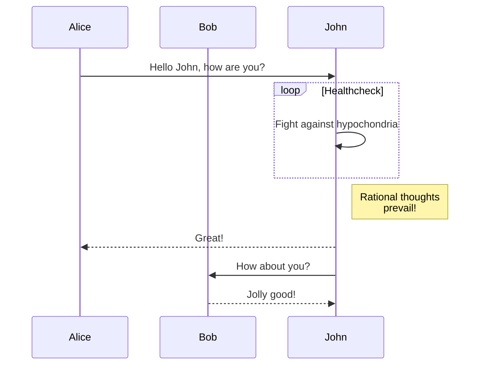

| 10/25 - 10/31 | **AIC, CSED, and Other Tips** <br/> 🔖 Complete [Module 8](/eng201-oer/jekyll/2025-08-09-w9.html){:target="_blank"} | Tue: 1 Ques in #classroom <br/> Fri: 1 Answer in #classroom | 

| 10/18 - 10/24 | **Understanding the Lit Review** <br/> 🔖 Complete [Module 7](/eng201-oer/jekyll/2025-08-08-w8.html){:target="_blank"} | Tue: 1 Ques in #classroom <br/> Fri: 1 Answer in #classroom <br/> Sat: Essay Draft 2 |

Understanding the Lit Review


https://uta.pressbooks.pub/advancedresearchmethodsinsw/chapter/6-4-annotating-sources/


nd Chapter 5: Working with Sources
Carillo

How to Read a Scholarly Article

•	Week 8 Video
•	OER: 6. How to Write a Literature Review
•	ENG201 LibGuide: What Are Annotated Bibs & Lit Reviews)
•	Lit Review Tutorial (read, watch, interact with all content)


This jekyll-theme supports [mermaid.js](https://mermaid.js.org/) to render diagrams
in markdown.

To enable the mermaid support, you need to set `mermaid: true` in the front matter
of your post.

```markdown
---
title: Diagrams with mermaid.js
date: 2023-08-31
layout: post
mermaid: true
---
```

Then you can use mermaid syntax in your markdown:

```
graph TD;
    A-->B;
    A-->C;
    B-->D;
    C-->D;
```


Or, even some complex examples:

```
sequenceDiagram
    participant Alice
    participant Bob
    Alice->>John: Hello John, how are you?
    loop Healthcheck
        John->>John: Fight against hypochondria
    end
    Note right of John: Rational thoughts <br/>prevail!
    John-->>Alice: Great!
    John->>Bob: How about you?
    Bob-->>John: Jolly good!
```



Refer to the [mermaid.js website](https://mermaid.js.org/intro/) for more examples.
