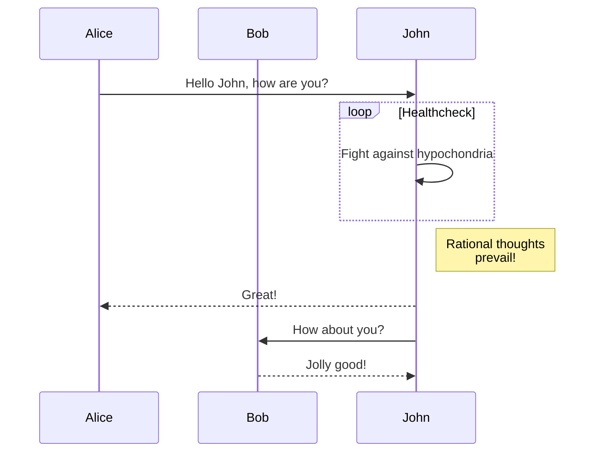

> ###### Are You Where You Should Be?
> This is Module 7: Understanding the Lit Review, which should be completed between Sat Oct 18 - Fri Oct 24. If you haven't completed everything in Module 6, go back and finish all outstanding tasks now. **Don't forget to click on and review each resource in this guide.**
{: .block-danger }

# Goals and Checklist

- 
- 
- 
- 

To help with various access needs, including task identification and separation and advance notice, I'll include an abbreviated list of tasks at the top of each weekly module. You can check these items off, but your input won't be saved after you close this window. **You remain responsible for checking the Calendar and ensuring that you're completing everything in a timely fashion.**

<div>
    <input type="checkbox" name="uchk">
    <label for="chk">Complete any outstanding tasks from Module 6</label>
</div>
<div>
  <input type="checkbox" name="uchk">
  <label for="uchk">Read/watch the material in this module, including these external resources: </label>
</div>
<div>
  <input type="checkbox" name="uchk">
  <label for="uchk">Write: </label>
</div>
<div>
  <input type="checkbox" name="uchk">
  <label for="uchk">Post your question by Tue 11:59PM (see <a href="https://visforvali.github.io/eng201-oer/pages/assignments/">Assignments</a>)</label>
</div>
<div>
  <input type="checkbox" name="uchk">
  <label for="uchk">Post your answer by Fri 11:59PM (see <a href="https://visforvali.github.io/eng201-oer/pages/assignments/">Assignments</a>)</label>
</div>
<div>
  <input type="checkbox" name="uchk">
  <label for="uchk">Post 5 potential interview questions to #team by Sat 11:59PM</label>
</div>


Understanding the Lit Review

https://www.lib.ncsu.edu/videos/literature-reviews-overview-graduate-students


Purdue OWL
https://owl.purdue.edu/owl/research_and_citation/conducting_research/writing_a_literature_review.html


Sample Student Work - Literature Reviews/Interviews
https://drive.google.com/drive/folders/1ugdiJxPXvtDQfH21U-GLylhdFxz649c8


PARA
Literature reviews ask: What do we know, or not know, about this particular issue/ topic/ subject? 

Literature reviews require “re-viewing” what credible scholars in the field have said, done, and found in order to help you:

    Identify what is currently known in your area of interest
    Establish an empirical/ theoretical/ foundation for your research
    Identify potential gaps in knowledge that you might fill
    Develop viable research questions and hypotheses
    Decide upon the scope of your research
    Demonstrate the importance of your research to the field


How well you answer this question depends upon:

    the effectiveness of your search for information
    the quality & reliability of the sources you choose
    your ability to synthesize the sources you select

A literature review is not a descriptive summary of what you found. All works included in the review must be read, evaluated, and analyzed, and synthesized, meaning that relationships between the works must also be discussed.  


The idea of a literature review paper, then, is to first analyze the literature and then synthesize it into a cohesive paper.  Recall that to analyze something means to break it down and examine the component parts.  In research situations, these literature reviews are leading the reader to a point.  Often, the point of a literature review is to provide background for a research hypothesis that the author is evaluating later in the paper.


nd Chapter 5: Working with Sources
Carillo

https://uta.pressbooks.pub/advancedresearchmethodsinsw/chapter/6-4-annotating-sources/


How to Read a Scholarly Article

•	Week 8 Video
•	OER: 6. How to Write a Literature Review
•	ENG201 LibGuide: What Are Annotated Bibs & Lit Reviews)
•	Lit Review Tutorial (read, watch, interact with all content)


This jekyll-theme supports [mermaid.js](https://mermaid.js.org/) to render diagrams
in markdown.

To enable the mermaid support, you need to set `mermaid: true` in the front matter
of your post.

```markdown
---
title: Diagrams with mermaid.js
date: 2023-08-31
layout: post
mermaid: true
---
```

Then you can use mermaid syntax in your markdown:

```
graph TD;
    A-->B;
    A-->C;
    B-->D;
    C-->D;
```


Or, even some complex examples:

```
sequenceDiagram
    participant Alice
    participant Bob
    Alice->>John: Hello John, how are you?
    loop Healthcheck
        John->>John: Fight against hypochondria
    end
    Note right of John: Rational thoughts <br/>prevail!
    John-->>Alice: Great!
    John->>Bob: How about you?
    Bob-->>John: Jolly good!
```



Refer to the [mermaid.js website](https://mermaid.js.org/intro/) for more examples.
